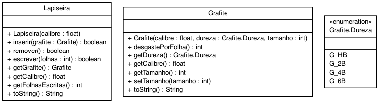

# Título do trabalho


Faça o modelo de uma lapiseira que pode conter um único grafite.

- [Requisitos](#requisitos)
- [Diagrama](#diagrama)
- [Exemplo de execução](#exemplo-de-execução)
- [Relatório de Entrega](#relatório-de-entrega)


## Requisitos

- Iniciar lapiseira
  - Inicia uma lapiseira de determinado calibre sem grafite.
- Inserir grafite
  - Insere um grafite passando
    - o calibre: float.
    - a dureza: string.
    - o tamanho em mm: int.
  - Não deve aceitar um grafite de calibre não compatível.
  - Não deve aceitar mais de um grafite.
  - Zera a contagem de folhas escritas da lapiseira.
- Remover grafite
  - Retira o grafite se houver algum.
- Escrever folha
  - Não é possível escrever se não há grafite.
  - A lapiseira deve contar o total de folhas escritas usando um grafite.
  - Quanto mais macio o grafite, mais rapidamente ele se acaba. Para simplificar, use a seguinte regra:
    - Grafite HB: 1mm por folha.
    - Grafite 2B: 2mm por folha.
    - Grafite 4B: 4mm por folha.
    - Grafite 6B: 6mm por folha.

  - Se o grafite acabar, defina o objeto grafite como `null`.
  - Se não houver grafite suficiente para terminar as folhas, contabilize quantas folhas completas foi possível escrever.
  - Avise quando o grafite acabar.
  
## Diagrama



## Exemplo de execução 

````java
public class Runner {

  public static void main(final String[] args) {

    //Inserindo grafites
    Lapiseira lapiseira = new Lapiseira(0.5f);
    System.out.println(lapiseira); // Lapiseira{calibre=0.5, grafite=null}

    //Calibre imcompativel
    if(lapiseira.inserir(new Grafite(0.7f, Grafite.Dureza.G_2B, 50)) == false) {
      System.out.println("fail: calibre incompatível"); //fail: calibre incompatível
    }
    lapiseira.inserir(new Grafite(0.5f, Grafite.Dureza.G_2B, 50));
    System.out.println(lapiseira); //Lapiseira{calibre=0.5, grafite=Grafite{calibre=0.5, dureza=Dureza{label='Grafite 2B'}, tamanho=50}}

    //Inserindo e Removendo
    lapiseira = new Lapiseira(0.3f);
    lapiseira.inserir(new Grafite(0.3f, Grafite.Dureza.G_2B, 50));
    System.out.println(lapiseira); //Lapiseira{calibre=0.3, grafite=Grafite{calibre=0.3, dureza=Dureza{label='Grafite 2B'}, tamanho=50}}

    if(lapiseira.inserir(new Grafite(0.3f, Grafite.Dureza.G_4B, 70)) == false) {
      System.out.println("fail: ja existe grafite"); //fail: ja existe grafite
    };
    System.out.println(lapiseira); //Lapiseira{calibre=0.3, grafite=Grafite{calibre=0.3, dureza=Dureza{label='Grafite 2B'}, tamanho=50}}
    lapiseira.remover();
    lapiseira.inserir(new Grafite(0.3f, Grafite.Dureza.G_4B, 70));
    System.out.println(lapiseira); //Lapiseira{calibre=0.3, grafite=Grafite{calibre=0.3, dureza=Dureza{label='Grafite 4B'}, tamanho=70}}

    //Escrevendo
    lapiseira = new Lapiseira(0.9f);
    lapiseira.inserir(new Grafite(0.9f, Grafite.Dureza.G_4B, 4));
    lapiseira.escrever(1);
    if(lapiseira.getGrafite() == null) {
      System.out.println("warning: grafite acabou"); //warning: grafite acabou
    }
    System.out.println(lapiseira); //Lapiseira{calibre=0.9, grafite=null}

    lapiseira.inserir(new Grafite(0.9f, Grafite.Dureza.G_4B, 30));
    lapiseira.escrever(6);
    System.out.println(lapiseira); //Lapiseira{calibre=0.9, grafite=Grafite{calibre=0.9, dureza=Dureza{label='Grafite 4B'}, tamanho=6}}

    if( lapiseira.escrever(3) == false) {
      System.out.println("warning: grafite acabou"); //warning: grafite acabou
      System.out.println(lapiseira.getFolhasEscritas() + " folhas escritas com esse grafite no total"); //8 folhas escritas com esse grafite no total
    }
    System.out.println(lapiseira); //Lapiseira{calibre=0.9, grafite=null}

    //case escrevendo 2
    lapiseira = new Lapiseira(0.9f);
    lapiseira.inserir(new Grafite(0.9f, Grafite.Dureza.G_2B, 15));
    System.out.println(lapiseira); //Lapiseira{calibre=0.9, grafite=Grafite{calibre=0.9, dureza=Dureza{label='Grafite 2B'}, tamanho=15}}

    lapiseira.escrever(4);
    System.out.println(lapiseira); //Lapiseira{calibre=0.9, grafite=Grafite{calibre=0.9, dureza=Dureza{label='Grafite 2B'}, tamanho=7}}

    if (lapiseira.escrever(4) == false){
      System.out.println("warning: grafite acabou"); //warning: grafite acabou
      System.out.println(lapiseira.getFolhasEscritas() + " folhas escritas com esse grafite no total"); //5 folhas escritas com esse grafite no total
    };

    System.out.println(lapiseira); //Lapiseira{calibre=0.9, grafite=null}

  }
}
````

## Relatório de Entrega

Não esqueça de preencher o seguinte formulário [Link para formulário](https://forms.gle/GeRf7CwafH7PaiGE7) ao completar a atividade.
